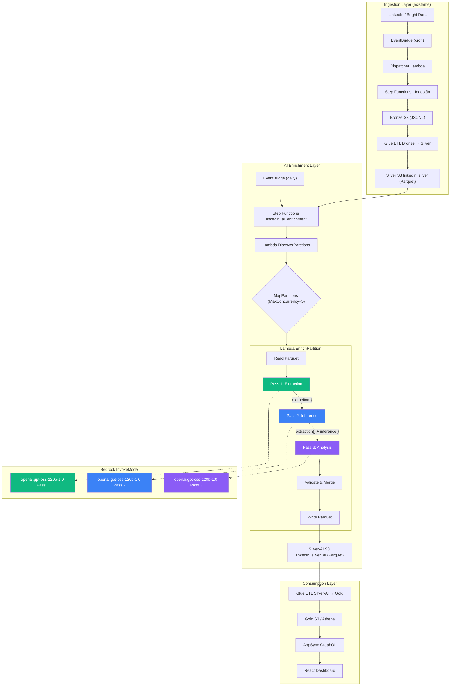

# AI Enrichment Pipeline - Arquitetura Completa

> **Projeto:** Data Engineer Jobs Enrichment With AI  
> **Versão:** 1.0  
> **Última atualização:** Dezembro 2025  
> **Modelo:** openai.gpt-oss-120b-1:0 (Amazon Bedrock)

---

## 📋 Sumário

1. [Visão Geral](#1-visão-geral)
2. [Arquitetura do Pipeline](#2-arquitetura-do-pipeline)
3. [Schema de Dados](#3-schema-de-dados)
4. [Pass 1: Extração Factual](#4-pass-1-extração-factual)
5. [Pass 2: Inferência Estruturada](#5-pass-2-inferência-estruturada)
6. [Pass 3: Análise Complexa](#6-pass-3-análise-complexa)
7. [Implementação Lambda](#7-implementação-lambda)
8. [Step Functions](#8-step-functions)
9. [Estimativas de Custo](#9-estimativas-de-custo)
10. [Validação e Qualidade](#10-validação-e-qualidade)

---

## 1. Visão Geral

### 1.1 Objetivo

Enriquecer vagas de Data Engineer extraídas do LinkedIn com metadados estruturados via LLM, transformando texto não-estruturado em dados analíticos para:

- Análise de tendências de mercado (stacks, clouds, salários)
- Identificação de oportunidades (remote, visa sponsorship)
- Detecção de red flags (scope creep, workload risk)
- Dashboard de inteligência de carreira

### 1.2 Princípios de Design

| Princípio | Implementação |
|-----------|---------------|
| **Cascading Context** | Cada pass recebe resultado dos anteriores |
| **Evidence-Based** | Toda inferência requer evidência + confidence |
| **Fail-Safe** | `null` e `not_mentioned` > chute |
| **Cost-Efficient** | openai.gpt-oss-120b-1:0 (~$0.0012/vaga) |
| **Idempotent** | Reprocessamento seguro via partições |

### 1.3 Números do Projeto

| Métrica | Valor |
|---------|-------|
| Volume inicial | 20.000 vagas |
| Ingestão semanal | ~5.000 vagas |
| Tokens médios/vaga | ~4.000 (input+output) |
| Custo estimado/vaga | ~$0.0012 |
| Custo mensal estimado | ~$25-30 |

---

## 2. Arquitetura do Pipeline

### 2.1 Diagrama de Fluxo

```
┌─────────────────────────────────────────────────────────────────────────────────┐
│                              INGESTION LAYER (existente)                         │
├─────────────────────────────────────────────────────────────────────────────────┤
│  LinkedIn/Bright Data → EventBridge → Lambda → Step Functions → Bronze S3       │
│                                                      ↓                           │
│                                              Glue ETL (Bronze→Silver)            │
│                                                      ↓                           │
│                                              Silver S3 (Parquet)                 │
│                                              linkedin_silver/                    │
└─────────────────────────────────────────────────────────────────────────────────┘
                                                       │
                                                       ▼
┌─────────────────────────────────────────────────────────────────────────────────┐
│                              AI ENRICHMENT LAYER (novo)                          │
├─────────────────────────────────────────────────────────────────────────────────┤
│                                                                                  │
│  EventBridge (daily) ──────► Step Functions: linkedin_ai_enrichment              │
│                                      │                                           │
│                                      ▼                                           │
│                          ┌─────────────────────┐                                 │
│                          │ DiscoverPartitions  │                                 │
│                          │      Lambda         │                                 │
│                          │ (Silver - SilverAI) │                                 │
│                          └──────────┬──────────┘                                 │
│                                     │                                            │
│                                     ▼                                            │
│                          ┌─────────────────────┐                                 │
│                          │    Map Partitions   │                                 │
│                          │  (MaxConcurrency=5) │                                 │
│                          └──────────┬──────────┘                                 │
│                                     │                                            │
│                    ┌────────────────┼────────────────┐                           │
│                    ▼                ▼                ▼                           │
│            ┌──────────────┐ ┌──────────────┐ ┌──────────────┐                    │
│            │ EnrichPartition│ EnrichPartition│ EnrichPartition                   │
│            │    Lambda    │ │    Lambda    │ │    Lambda    │                    │
│            └──────┬───────┘ └──────┬───────┘ └──────┬───────┘                    │
│                   │                │                │                            │
│                   └────────────────┼────────────────┘                            │
│                                    ▼                                             │
│                          ┌─────────────────────┐                                 │
│                          │   Silver-AI S3      │                                 │
│                          │ linkedin_silver_ai/ │                                 │
│                          └─────────────────────┘                                 │
│                                                                                  │
└─────────────────────────────────────────────────────────────────────────────────┘
                                                       │
                                                       ▼
┌─────────────────────────────────────────────────────────────────────────────────┐
│                              CONSUMPTION LAYER                                   │
├─────────────────────────────────────────────────────────────────────────────────┤
│  Glue ETL (Silver-AI → Gold) → Gold S3 → Athena/AppSync → React Dashboard       │
└─────────────────────────────────────────────────────────────────────────────────┘
```

### 2.2 Fluxo Interno do EnrichPartition Lambda

```
┌─────────────────────────────────────────────────────────────────────────────────┐
│                          EnrichPartition Lambda                                  │
├─────────────────────────────────────────────────────────────────────────────────┤
│                                                                                  │
│  1. READ: Parquet da partição Silver                                             │
│           ↓                                                                      │
│  2. FOR EACH job in partition:                                                   │
│           │                                                                      │
│           ▼                                                                      │
│     ┌─────────────────────────────────────────────────────────────────────────┐  │
│     │  PASS 1: Extração Factual                                               │  │
│     │  ─────────────────────────                                              │  │
│     │  Input:  raw_description, title, location                               │  │
│     │  Model:  openai.gpt-oss-120b-1:0                                                   │  │
│     │  Output: extraction{} (salary, skills, work_model, visa_text...)        │  │
│     └─────────────────────────────────────────────────────────────────────────┘  │
│           │                                                                      │
│           │ pass1_result                                                         │
│           ▼                                                                      │
│     ┌─────────────────────────────────────────────────────────────────────────┐  │
│     │  PASS 2: Inferência Estruturada                                         │  │
│     │  ──────────────────────────────                                         │  │
│     │  Input:  raw_description + pass1_result.extraction                      │  │
│     │  Model:  openai.gpt-oss-120b-1:0                                                   │  │
│     │  Output: inference{} (seniority, cloud, paradigm, visa... + confidence) │  │
│     └─────────────────────────────────────────────────────────────────────────┘  │
│           │                                                                      │
│           │ pass1_result + pass2_result                                          │
│           ▼                                                                      │
│     ┌─────────────────────────────────────────────────────────────────────────┐  │
│     │  PASS 3: Análise Complexa                                               │  │
│     │  ────────────────────────                                               │  │
│     │  Input:  raw_description + pass1_result + pass2_result                  │  │
│     │  Model:  openai.gpt-oss-120b-1:0                                                   │  │
│     │  Output: analysis{} (maturity, red_flags, culture... + confidence)      │  │
│     └─────────────────────────────────────────────────────────────────────────┘  │
│           │                                                                      │
│           │ merged_result                                                        │
│           ▼                                                                      │
│  3. VALIDATE: JSON schema + confidence thresholds                                │
│           ↓                                                                      │
│  4. MERGE: original Silver columns + enrichment columns                          │
│           ↓                                                                      │
│  5. WRITE: Parquet para Silver-AI (mesma partição)                               │
│                                                                                  │
└─────────────────────────────────────────────────────────────────────────────────┘
```

### 2.3 State Management (sem DynamoDB)

O estado de processamento é derivado da **existência de partições**:

```python
# DiscoverPartitions Lambda
def get_pending_partitions():
    silver_partitions = list_s3_partitions("s3://bucket/silver/linkedin/")
    silver_ai_partitions = list_s3_partitions("s3://bucket/silver-ai/linkedin/")
    
    # Partições pendentes = Silver - SilverAI
    pending = silver_partitions - silver_ai_partitions
    
    return [
        {
            "silver_path": f"s3://bucket/silver/linkedin/{p}/",
            "silver_ai_path": f"s3://bucket/silver-ai/linkedin/{p}/"
        }
        for p in pending
    ]
```

**Para reprocessar:** Deletar a partição em Silver-AI e re-executar a Step Function.

---

## 3. Schema de Dados

### 3.1 Input: Silver (existente)

Colunas disponíveis do seu CSV:

```
job_posting_id          STRING      -- PK
source_system           STRING      -- "linkedin"
url                     STRING
scraped_at              TIMESTAMP
company_name            STRING
company_id              STRING
job_title               STRING
job_seniority_level     STRING      -- do LinkedIn (pode ser "Not Applicable")
job_function            STRING
job_employment_type     STRING
job_industries          STRING
job_location            STRING
country_code            STRING
job_posted_datetime     TIMESTAMP
job_posted_date_only    DATE
job_num_applicants      INT
salary_min              DOUBLE      -- pode ser null
salary_max              DOUBLE
salary_currency         STRING
salary_period           STRING
job_summary             STRING
job_description_text    STRING      -- 🎯 PRINCIPAL INPUT PARA LLM
skills_canonical        ARRAY<STRING>
skills_families         ARRAY<STRING>
year                    INT         -- partição
month                   INT         -- partição
day                     INT         -- partição
hour                    INT         -- partição
```

### 3.2 Output: Silver-AI (novo)

```
═══════════════════════════════════════════════════════════════════════════════════
COLUNAS ORIGINAIS DO SILVER (mantidas)
═══════════════════════════════════════════════════════════════════════════════════
job_posting_id, source_system, url, scraped_at, company_name, company_id,
job_title, job_seniority_level, job_function, job_employment_type, job_industries,
job_location, country_code, job_posted_datetime, job_posted_date_only,
job_num_applicants, salary_min, salary_max, salary_currency, salary_period,
job_summary, job_description_text, skills_canonical, skills_families,
year, month, day, hour

═══════════════════════════════════════════════════════════════════════════════════
PASS 1: EXTRACTION (colunas factuais - sem confidence, são fatos)
═══════════════════════════════════════════════════════════════════════════════════
-- Compensação Explícita
ext_salary_disclosed            BOOLEAN
ext_salary_min                  DOUBLE
ext_salary_max                  DOUBLE
ext_salary_currency             STRING
ext_salary_period               STRING      -- yearly|monthly|hourly
ext_salary_text_raw             STRING
ext_hourly_rate_min             DOUBLE
ext_hourly_rate_max             DOUBLE
ext_equity_mentioned            BOOLEAN

-- Work Authorization Explícita
ext_visa_sponsorship_stated     STRING      -- yes|no|not_mentioned
ext_work_auth_text              STRING
ext_citizenship_text            STRING
ext_security_clearance_stated   STRING      -- required|preferred|not_mentioned

-- Modelo de Trabalho Explícito
ext_work_model_stated           STRING      -- remote|hybrid|onsite|not_mentioned
ext_location_restriction_text   STRING
ext_employment_type_stated      STRING      -- full_time|contract|internship|not_mentioned
ext_contract_duration_stated    STRING

-- Skills e Requisitos Explícitos
ext_skills_mentioned            ARRAY<STRING>
ext_certifications_mentioned    ARRAY<STRING>
ext_years_experience_stated     STRING
ext_education_stated            STRING

-- Benefícios
ext_benefits_mentioned          ARRAY<STRING>

-- Contexto da Empresa/Time
ext_team_info_text              STRING
ext_company_description_text    STRING

═══════════════════════════════════════════════════════════════════════════════════
PASS 2: INFERENCE (colunas inferidas - com confidence)
═══════════════════════════════════════════════════════════════════════════════════
-- Seniority & Role
inf_seniority_level             STRING      -- intern|junior|mid|senior|staff|principal|lead
inf_seniority_confidence        DOUBLE
inf_seniority_evidence          STRING
inf_years_experience_min        INT
inf_years_experience_max        INT
inf_job_family                  STRING      -- data_engineer|analytics_engineer|ml_engineer|platform
inf_job_family_confidence       DOUBLE
inf_sub_specialty               STRING      -- streaming|batch|governance|platform|general

-- Stack & Cloud
inf_primary_cloud               STRING      -- aws|azure|gcp|multi|on_prem|unclear
inf_primary_cloud_confidence    DOUBLE
inf_secondary_clouds            ARRAY<STRING>
inf_processing_paradigm         STRING      -- batch|streaming|hybrid|unclear
inf_storage_layer               STRING      -- warehouse|lake|lakehouse|mixed|unclear
inf_orchestration_type          STRING      -- airflow|dagster|prefect|dbt_cloud|cloud_native
inf_tooling_modernity           STRING      -- modern_data_stack|traditional|mixed

-- Geo & Work Model
inf_geo_restriction             STRING      -- us_only|eu_only|latam_ok|global|unclear
inf_geo_restriction_confidence  DOUBLE
inf_remote_level                STRING      -- fully_remote|hybrid|onsite|remote_restricted
inf_timezone_requirement        STRING      -- americas|europe|apac|flexible|unclear
inf_allowed_countries           ARRAY<STRING>
inf_us_states_allowed           ARRAY<STRING>

-- Visa & Authorization
inf_visa_sponsorship            STRING      -- sponsors|no_sponsorship|unclear
inf_visa_sponsorship_confidence DOUBLE
inf_accepted_work_auth          ARRAY<STRING>   -- citizen|gc|h1b|opt|cpt|ead|tn|l1|o1
inf_h1b_friendly                BOOLEAN
inf_opt_cpt_friendly            BOOLEAN

-- Contract & Compensation
inf_employment_type             STRING      -- full_time|contract|c2h|part_time|internship
inf_contract_structure          STRING      -- w2|c2c|1099|any|unclear
inf_pay_structure               STRING      -- salary|hourly|daily|project
inf_contract_duration_months    INT
inf_conversion_to_fte           STRING      -- yes|possible|no|not_applicable

-- Requirements Classification
inf_must_have_skills            ARRAY<STRING>
inf_nice_to_have_skills         ARRAY<STRING>
inf_must_have_soft_skills       ARRAY<STRING>

═══════════════════════════════════════════════════════════════════════════════════
PASS 3: ANALYSIS (colunas analíticas - com confidence)
═══════════════════════════════════════════════════════════════════════════════════
-- Company & Team Maturity
anl_data_maturity_level         STRING      -- ad_hoc|basic_reporting|structured_analytics|governed_dwh|ml_at_scale
anl_data_maturity_confidence    DOUBLE
anl_data_maturity_evidence      STRING
anl_company_stage               STRING      -- early_startup|growth|scale_up|mature|enterprise
anl_company_stage_confidence    DOUBLE
anl_team_size_current           INT
anl_team_size_building          BOOLEAN
anl_backfill_vs_growth          STRING      -- new_role|backfill|team_expansion|unclear

-- Red Flags & Role Quality
anl_scope_creep_score           DOUBLE      -- 0.0 a 1.0
anl_scope_creep_confidence      DOUBLE
anl_role_clarity                STRING      -- very_clear|clear|vague|confusing
anl_workload_risk_score         DOUBLE      -- 0.0 a 1.0
anl_red_flag_keywords           ARRAY<STRING>
anl_overall_risk                STRING      -- low|medium|high

-- Stakeholders & Leadership
anl_stakeholder_interaction     ARRAY<STRING>   -- engineering|product|business|ds|c_level
anl_leadership_expectation      STRING      -- ic_only|tech_lead|people_manager
anl_communication_intensity     STRING      -- low|medium|high

-- Tech Culture
anl_tech_culture_signals        ARRAY<STRING>   -- open_source|tech_blog|conferences|modern_practices
anl_innovation_level            STRING      -- cutting_edge|modern|stable|legacy|unclear
anl_learning_culture            STRING      -- strong|moderate|weak|unclear

-- AI/ML Integration
anl_ml_integration_level        STRING      -- none|ml_support|mlops|ml_heavy|genai_focus
anl_genai_mentioned             BOOLEAN
anl_ml_tools_mentioned          ARRAY<STRING>

-- Competition & Timing
anl_hiring_urgency              STRING      -- immediate|soon|normal|pipeline
anl_hiring_urgency_confidence   DOUBLE

═══════════════════════════════════════════════════════════════════════════════════
METADATA
═══════════════════════════════════════════════════════════════════════════════════
enriched_at                     TIMESTAMP
enrichment_version              STRING      -- "1.0"
enrichment_model                STRING      -- "openai.gpt-oss-120b-1:0"
pass1_success                   BOOLEAN
pass2_success                   BOOLEAN
pass3_success                   BOOLEAN
total_tokens_used               INT
enrichment_cost_usd             DOUBLE
avg_confidence_pass2            DOUBLE
avg_confidence_pass3            DOUBLE
low_confidence_fields           ARRAY<STRING>   -- campos com confidence < 0.5
```

---

## 4. Pass 1: Extração Factual

### 4.1 Objetivo

Extrair **apenas dados explícitos** do texto. Sem inferência, sem interpretação. Se não está escrito, retorna `null`.

### 4.2 Prompt Template

```
You are a precise data extractor. Extract ONLY explicitly stated information from job postings.

## CRITICAL RULES
1. Extract ONLY what is written - NO inference, NO interpretation
2. If information is not explicitly stated, use null
3. Copy exact text for text fields (like work_auth_text)
4. For boolean fields, only return true if explicitly mentioned
5. This data will be used by subsequent analysis - accuracy is critical

## INPUT
<job_posting>
Title: {job_title}
Company: {company_name}
Location: {job_location}

Description:
{job_description_text}
</job_posting>

## OUTPUT FORMAT
Return ONLY valid JSON with this exact structure:

```json
{
  "extraction": {
    "compensation": {
      "salary_disclosed": boolean,
      "salary_min": number or null,
      "salary_max": number or null,
      "salary_currency": string or null,
      "salary_period": "yearly" | "monthly" | "hourly" | null,
      "salary_text_raw": string or null,
      "hourly_rate_min": number or null,
      "hourly_rate_max": number or null,
      "equity_mentioned": boolean
    },
    "work_authorization": {
      "visa_sponsorship_stated": "yes" | "no" | "not_mentioned",
      "work_auth_text": string or null,
      "citizenship_text": string or null,
      "security_clearance_stated": "required" | "preferred" | "not_mentioned"
    },
    "work_model": {
      "work_model_stated": "remote" | "hybrid" | "onsite" | "not_mentioned",
      "location_restriction_text": string or null,
      "employment_type_stated": "full_time" | "contract" | "internship" | "part_time" | "not_mentioned",
      "contract_duration_stated": string or null
    },
    "requirements": {
      "skills_mentioned": [array of strings],
      "certifications_mentioned": [array of strings],
      "years_experience_stated": string or null,
      "education_stated": string or null
    },
    "benefits": {
      "benefits_mentioned": [array of strings]
    },
    "context": {
      "team_info_text": string or null,
      "company_description_text": string or null
    }
  },
  "metadata": {
    "extraction_complete": boolean,
    "fields_found": number,
    "fields_null": number
  }
}
```

Extract now:
```

### 4.3 Exemplo de Output (Vaga M3BI)

```json
{
  "extraction": {
    "compensation": {
      "salary_disclosed": false,
      "salary_min": null,
      "salary_max": null,
      "salary_currency": null,
      "salary_period": null,
      "salary_text_raw": null,
      "hourly_rate_min": null,
      "hourly_rate_max": null,
      "equity_mentioned": false
    },
    "work_authorization": {
      "visa_sponsorship_stated": "not_mentioned",
      "work_auth_text": null,
      "citizenship_text": null,
      "security_clearance_stated": "not_mentioned"
    },
    "work_model": {
      "work_model_stated": "onsite",
      "location_restriction_text": "Day 1 onsite",
      "employment_type_stated": "full_time",
      "contract_duration_stated": null
    },
    "requirements": {
      "skills_mentioned": ["GCP", "BigQuery", "Dataflow", "SQL", "Python", "Wherescape", "ERwin", "ER/Studio"],
      "certifications_mentioned": ["GCP Professional Data Engineer", "GCP Architect"],
      "years_experience_stated": "5 years",
      "education_stated": "Bachelor's or master's degree in computer science, Data Engineering, Information Systems, or related STEM field"
    },
    "benefits": {
      "benefits_mentioned": []
    },
    "context": {
      "team_info_text": null,
      "company_description_text": "Full time with Zensar"
    }
  },
  "metadata": {
    "extraction_complete": true,
    "fields_found": 12,
    "fields_null": 11
  }
}
```

---

## 5. Pass 2: Inferência Estruturada

### 5.1 Objetivo

Normalizar e inferir campos com base no texto + dados do Pass 1. Cada inferência requer `value`, `confidence`, `evidence`, e `source`.

### 5.2 Prompt Template

```
You are a job market analyst. Normalize and infer structured data from job postings.
You have access to already-extracted factual data from Pass 1.

## ALREADY EXTRACTED (Pass 1)
<pass1_extraction>
{pass1_extraction_json}
</pass1_extraction>

## INFERENCE RULES
1. Use Pass 1 data as PRIMARY source - it's validated
2. Use raw description to FILL GAPS and add context
3. Every inference needs: value, confidence (0-1), evidence, source
4. Reference Pass 1 fields in evidence when applicable
5. If Pass 1 has the answer explicitly, confidence should be 0.9+
6. If you cannot infer with reasonable confidence, use null

## CONFIDENCE SCALE
- 0.9-1.0: From Pass 1 or explicit in text
- 0.7-0.9: Strong inference, multiple signals
- 0.5-0.7: Moderate inference, 1-2 signals
- 0.3-0.5: Weak inference (include but flag)
- <0.3: Do NOT include, use null instead

## SOURCE TYPES
- "pass1_derived": Directly from Pass 1 extraction
- "inferred": Deduced from text patterns
- "combined": Mix of Pass 1 + text inference

## RAW JOB POSTING
<job_posting>
Title: {job_title}
Company: {company_name}
Location: {job_location}

Description:
{job_description_text}
</job_posting>

## OUTPUT FORMAT
Return ONLY valid JSON:

```json
{
  "inference": {
    "seniority_and_role": {
      "seniority_level": {
        "value": "junior" | "mid" | "senior" | "staff" | "principal" | "lead" | null,
        "confidence": 0.0-1.0,
        "evidence": "string explaining why",
        "source": "pass1_derived" | "inferred" | "combined"
      },
      "years_experience": {
        "value": { "min": number, "max": number } or null,
        "confidence": 0.0-1.0,
        "evidence": "string",
        "source": "string"
      },
      "job_family": {
        "value": "data_engineer" | "analytics_engineer" | "ml_engineer" | "platform" | null,
        "confidence": 0.0-1.0,
        "evidence": "string",
        "source": "string"
      },
      "sub_specialty": {
        "value": "streaming" | "batch" | "governance" | "platform" | "modeling" | "general" | null,
        "confidence": 0.0-1.0,
        "evidence": "string",
        "source": "string"
      }
    },
    "stack_and_cloud": {
      "primary_cloud": {
        "value": "aws" | "azure" | "gcp" | "multi" | "on_prem" | null,
        "confidence": 0.0-1.0,
        "evidence": "string",
        "source": "string"
      },
      "secondary_clouds": {
        "value": ["array"] or null,
        "confidence": 0.0-1.0,
        "evidence": "string",
        "source": "string"
      },
      "processing_paradigm": {
        "value": "batch" | "streaming" | "hybrid" | null,
        "confidence": 0.0-1.0,
        "evidence": "string",
        "source": "string"
      },
      "storage_layer": {
        "value": "warehouse" | "lake" | "lakehouse" | "mixed" | null,
        "confidence": 0.0-1.0,
        "evidence": "string",
        "source": "string"
      },
      "orchestration_type": {
        "value": "airflow" | "dagster" | "prefect" | "dbt_cloud" | "cloud_native" | null,
        "confidence": 0.0-1.0,
        "evidence": "string",
        "source": "string"
      },
      "tooling_modernity": {
        "value": "modern_data_stack" | "traditional" | "mixed" | null,
        "confidence": 0.0-1.0,
        "evidence": "string",
        "source": "string"
      }
    },
    "geo_and_work_model": {
      "geo_restriction": {
        "value": "us_only" | "eu_only" | "latam_ok" | "global" | null,
        "confidence": 0.0-1.0,
        "evidence": "string",
        "source": "string"
      },
      "remote_level": {
        "value": "fully_remote" | "hybrid" | "onsite" | "remote_restricted" | null,
        "confidence": 0.0-1.0,
        "evidence": "string",
        "source": "string"
      },
      "timezone_requirement": {
        "value": "americas" | "europe" | "apac" | "flexible" | null,
        "confidence": 0.0-1.0,
        "evidence": "string",
        "source": "string"
      },
      "allowed_countries": {
        "value": ["array"] or null,
        "confidence": 0.0-1.0,
        "evidence": "string",
        "source": "string"
      },
      "us_states_allowed": {
        "value": ["array"] or null,
        "confidence": 0.0-1.0,
        "evidence": "string",
        "source": "string"
      }
    },
    "visa_and_authorization": {
      "visa_sponsorship": {
        "value": "sponsors" | "no_sponsorship" | null,
        "confidence": 0.0-1.0,
        "evidence": "string",
        "source": "string"
      },
      "accepted_work_auth": {
        "value": ["citizen", "gc", "h1b", "opt", "cpt", "ead", "tn", "l1", "o1"] or null,
        "confidence": 0.0-1.0,
        "evidence": "string",
        "source": "string"
      },
      "h1b_friendly": {
        "value": boolean or null,
        "confidence": 0.0-1.0,
        "evidence": "string",
        "source": "string"
      },
      "opt_cpt_friendly": {
        "value": boolean or null,
        "confidence": 0.0-1.0,
        "evidence": "string",
        "source": "string"
      }
    },
    "contract_and_compensation": {
      "employment_type": {
        "value": "full_time" | "contract" | "c2h" | "part_time" | "internship" | null,
        "confidence": 0.0-1.0,
        "evidence": "string",
        "source": "string"
      },
      "contract_structure": {
        "value": "w2" | "c2c" | "1099" | "any" | null,
        "confidence": 0.0-1.0,
        "evidence": "string",
        "source": "string"
      },
      "pay_structure": {
        "value": "salary" | "hourly" | "daily" | "project" | null,
        "confidence": 0.0-1.0,
        "evidence": "string",
        "source": "string"
      },
      "contract_duration_months": {
        "value": number or null,
        "confidence": 0.0-1.0,
        "evidence": "string",
        "source": "string"
      }
    },
    "requirements_classification": {
      "must_have_skills": {
        "value": ["array"] or null,
        "confidence": 0.0-1.0,
        "evidence": "string",
        "source": "string"
      },
      "nice_to_have_skills": {
        "value": ["array"] or null,
        "confidence": 0.0-1.0,
        "evidence": "string",
        "source": "string"
      },
      "must_have_soft_skills": {
        "value": ["array"] or null,
        "confidence": 0.0-1.0,
        "evidence": "string",
        "source": "string"
      }
    }
  },
  "metadata": {
    "fields_from_pass1": number,
    "fields_inferred": number,
    "avg_confidence": number
  }
}
```

Infer now:
```

### 5.3 Exemplo de Output (Vaga M3BI)

```json
{
  "inference": {
    "seniority_and_role": {
      "seniority_level": {
        "value": "mid",
        "confidence": 0.65,
        "evidence": "Title says 'Jr' but requires 5 years experience - mismatch suggests mid-level despite title",
        "source": "combined"
      },
      "years_experience": {
        "value": { "min": 5, "max": 5 },
        "confidence": 0.95,
        "evidence": "Pass1.requirements.years_experience_stated = '5 years'",
        "source": "pass1_derived"
      },
      "job_family": {
        "value": "data_engineer",
        "confidence": 0.75,
        "evidence": "Title 'Data Modeler' but skills (BigQuery, Dataflow, SQL) align with DE",
        "source": "inferred"
      },
      "sub_specialty": {
        "value": "modeling",
        "confidence": 0.9,
        "evidence": "Title explicitly 'Data Modeler', focus on normalization, dimensional modeling",
        "source": "inferred"
      }
    },
    "stack_and_cloud": {
      "primary_cloud": {
        "value": "gcp",
        "confidence": 0.95,
        "evidence": "Pass1.requirements.skills_mentioned includes GCP, BigQuery, Dataflow",
        "source": "pass1_derived"
      },
      "secondary_clouds": {
        "value": null,
        "confidence": 0,
        "evidence": null,
        "source": "not_found"
      },
      "processing_paradigm": {
        "value": "batch",
        "confidence": 0.7,
        "evidence": "Dataflow mentioned but focus on data warehousing suggests primarily batch",
        "source": "inferred"
      },
      "storage_layer": {
        "value": "warehouse",
        "confidence": 0.85,
        "evidence": "Strong focus on 'data warehousing', dimensional modeling, BigQuery",
        "source": "inferred"
      },
      "orchestration_type": {
        "value": null,
        "confidence": 0,
        "evidence": null,
        "source": "not_found"
      },
      "tooling_modernity": {
        "value": "mixed",
        "confidence": 0.7,
        "evidence": "GCP/BigQuery (modern) + ERwin/Wherescape (traditional tools)",
        "source": "inferred"
      }
    },
    "geo_and_work_model": {
      "geo_restriction": {
        "value": "us_only",
        "confidence": 0.85,
        "evidence": "Location is Phoenix, AZ; 'Day 1 onsite' suggests US presence required",
        "source": "inferred"
      },
      "remote_level": {
        "value": "onsite",
        "confidence": 0.95,
        "evidence": "Pass1.work_model.work_model_stated = 'onsite', 'Day 1 onsite' in title",
        "source": "pass1_derived"
      },
      "timezone_requirement": {
        "value": "americas",
        "confidence": 0.8,
        "evidence": "Phoenix, AZ location implies US timezone",
        "source": "inferred"
      },
      "allowed_countries": {
        "value": ["US"],
        "confidence": 0.8,
        "evidence": "Onsite in Phoenix, AZ",
        "source": "inferred"
      },
      "us_states_allowed": {
        "value": ["AZ"],
        "confidence": 0.9,
        "evidence": "Location explicitly Phoenix, AZ",
        "source": "inferred"
      }
    },
    "visa_and_authorization": {
      "visa_sponsorship": {
        "value": null,
        "confidence": 0,
        "evidence": null,
        "source": "not_found"
      },
      "accepted_work_auth": {
        "value": null,
        "confidence": 0,
        "evidence": null,
        "source": "not_found"
      },
      "h1b_friendly": {
        "value": null,
        "confidence": 0,
        "evidence": null,
        "source": "not_found"
      },
      "opt_cpt_friendly": {
        "value": null,
        "confidence": 0,
        "evidence": null,
        "source": "not_found"
      }
    },
    "contract_and_compensation": {
      "employment_type": {
        "value": "full_time",
        "confidence": 0.95,
        "evidence": "Pass1.work_model.employment_type_stated = 'full_time', title says 'Full time with Zensar'",
        "source": "pass1_derived"
      },
      "contract_structure": {
        "value": "w2",
        "confidence": 0.6,
        "evidence": "Full-time with Zensar (staffing company) typically W2",
        "source": "inferred"
      },
      "pay_structure": {
        "value": "salary",
        "confidence": 0.7,
        "evidence": "Full-time role typically salary, no hourly rate mentioned",
        "source": "inferred"
      },
      "contract_duration_months": {
        "value": null,
        "confidence": 0,
        "evidence": null,
        "source": "not_found"
      }
    },
    "requirements_classification": {
      "must_have_skills": {
        "value": ["GCP", "BigQuery", "Dataflow", "SQL", "Python", "data modeling", "dimensional modeling"],
        "confidence": 0.85,
        "evidence": "Listed without 'Nice to Have' prefix",
        "source": "inferred"
      },
      "nice_to_have_skills": {
        "value": ["GCP Professional Data Engineer certification", "data governance", "data mesh"],
        "confidence": 0.9,
        "evidence": "Explicitly under 'Nice to Have' section",
        "source": "pass1_derived"
      },
      "must_have_soft_skills": {
        "value": ["communication", "attention to detail", "documentation"],
        "confidence": 0.8,
        "evidence": "Mentioned: 'Excellent communication and documentation skills', 'Attention to detail'",
        "source": "inferred"
      }
    }
  },
  "metadata": {
    "fields_from_pass1": 8,
    "fields_inferred": 18,
    "avg_confidence": 0.72
  }
}
```

---

## 6. Pass 3: Análise Complexa

### 6.1 Objetivo

Análises de alto nível que requerem interpretação: maturidade, red flags, cultura, stakeholders. Maior risco de subjetividade, por isso requer evidências fortes.

### 6.2 Prompt Template

```
You are a senior job market analyst. Perform deep analysis on job postings.
You have access to extracted data (Pass 1) AND inferred data (Pass 2).

## EXTRACTED DATA (Pass 1)
<pass1_extraction>
{pass1_extraction_json}
</pass1_extraction>

## INFERRED DATA (Pass 2)
<pass2_inference>
{pass2_inference_json}
</pass2_inference>

## ANALYSIS RULES
1. Use BOTH Pass 1 and Pass 2 to inform analysis
2. Reference specific fields from previous passes in evidence
3. These are SUBJECTIVE assessments - be conservative with confidence
4. If previous passes lack data, explicitly say "insufficient data"
5. Always provide reasoning, not just values

## WHAT YOU'RE ANALYZING
- Data maturity: How sophisticated is their data org?
- Red flags: Scope creep, workload risk, role clarity
- Team context: Who you'd work with, leadership expectations
- Culture signals: Tech culture, innovation, learning
- AI/ML involvement: Is this a pure DE role or ML-adjacent?
- Competition: Hiring urgency

## RAW JOB POSTING
<job_posting>
Title: {job_title}
Company: {company_name}
Location: {job_location}

Description:
{job_description_text}
</job_posting>

## OUTPUT FORMAT
Return ONLY valid JSON:

```json
{
  "analysis": {
    "company_maturity": {
      "data_maturity_level": {
        "value": "ad_hoc" | "basic_reporting" | "structured_analytics" | "governed_dwh" | "ml_at_scale" | null,
        "confidence": 0.0-1.0,
        "evidence": "string referencing Pass1/Pass2 fields",
        "reasoning": "string explaining the logic"
      },
      "company_stage": {
        "value": "early_startup" | "growth" | "scale_up" | "mature" | "enterprise" | null,
        "confidence": 0.0-1.0,
        "evidence": "string",
        "reasoning": "string"
      },
      "team_size": {
        "value": { "current": number or null, "building": boolean },
        "confidence": 0.0-1.0,
        "evidence": "string",
        "reasoning": "string"
      },
      "backfill_vs_growth": {
        "value": "new_role" | "backfill" | "team_expansion" | null,
        "confidence": 0.0-1.0,
        "evidence": "string",
        "reasoning": "string"
      }
    },
    "red_flags_and_role_quality": {
      "scope_creep_score": {
        "value": 0.0-1.0,
        "confidence": 0.0-1.0,
        "evidence": "string",
        "reasoning": "string"
      },
      "role_clarity": {
        "value": "very_clear" | "clear" | "vague" | "confusing" | null,
        "confidence": 0.0-1.0,
        "evidence": "string",
        "reasoning": "string"
      },
      "workload_risk_score": {
        "value": 0.0-1.0,
        "confidence": 0.0-1.0,
        "evidence": "string",
        "reasoning": "string"
      },
      "red_flag_keywords": {
        "value": ["array of keywords found"],
        "confidence": 0.0-1.0,
        "evidence": "string"
      },
      "overall_risk": {
        "value": "low" | "medium" | "high",
        "confidence": 0.0-1.0,
        "reasoning": "string"
      }
    },
    "stakeholders_and_leadership": {
      "stakeholder_interaction": {
        "value": ["engineering", "product", "business", "data_science", "c_level"],
        "confidence": 0.0-1.0,
        "evidence": "string",
        "reasoning": "string"
      },
      "leadership_expectation": {
        "value": "ic_only" | "tech_lead" | "people_manager" | null,
        "confidence": 0.0-1.0,
        "evidence": "string",
        "reasoning": "string"
      },
      "communication_intensity": {
        "value": "low" | "medium" | "high" | null,
        "confidence": 0.0-1.0,
        "evidence": "string",
        "reasoning": "string"
      }
    },
    "tech_culture": {
      "tech_culture_signals": {
        "value": ["array of signals found"],
        "confidence": 0.0-1.0,
        "evidence": "string"
      },
      "innovation_level": {
        "value": "cutting_edge" | "modern" | "stable" | "legacy" | null,
        "confidence": 0.0-1.0,
        "evidence": "string",
        "reasoning": "string"
      },
      "learning_culture": {
        "value": "strong" | "moderate" | "weak" | null,
        "confidence": 0.0-1.0,
        "evidence": "string",
        "reasoning": "string"
      }
    },
    "ai_ml_integration": {
      "ml_integration_level": {
        "value": "none" | "ml_support" | "mlops" | "ml_heavy" | "genai_focus" | null,
        "confidence": 0.0-1.0,
        "evidence": "string",
        "reasoning": "string"
      },
      "genai_mentioned": {
        "value": boolean,
        "confidence": 0.0-1.0,
        "evidence": "string"
      },
      "ml_tools_mentioned": {
        "value": ["array"] or null,
        "confidence": 0.0-1.0,
        "evidence": "string"
      }
    },
    "competition_and_timing": {
      "hiring_urgency": {
        "value": "immediate" | "soon" | "normal" | "pipeline" | null,
        "confidence": 0.0-1.0,
        "evidence": "string",
        "reasoning": "string"
      }
    }
  },
  "summary": {
    "recommendation": "string - brief assessment of this role",
    "strengths": ["array of positives"],
    "concerns": ["array of concerns"],
    "fit_for": "string - what type of candidate this suits"
  },
  "metadata": {
    "fields_analyzed": number,
    "avg_confidence": number,
    "low_confidence_fields": ["array of field names with confidence < 0.5"]
  }
}
```

Analyze now:
```

### 6.3 Exemplo de Output (Vaga M3BI)

```json
{
  "analysis": {
    "company_maturity": {
      "data_maturity_level": {
        "value": "governed_dwh",
        "confidence": 0.7,
        "evidence": "Pass2.storage_layer=warehouse, Pass2.sub_specialty=modeling, mentions 'data governance' and 'regulatory requirements'",
        "reasoning": "Focus on data modeling, governance, and banking regulations suggests structured/governed environment"
      },
      "company_stage": {
        "value": "enterprise",
        "confidence": 0.6,
        "evidence": "Client is in 'Banking' industry (Pass1), Zensar is established IT services company",
        "reasoning": "Banking client with formal governance requirements = likely enterprise"
      },
      "team_size": {
        "value": { "current": null, "building": false },
        "confidence": 0.3,
        "evidence": "No team size information in Pass1.context.team_info_text",
        "reasoning": "Insufficient data"
      },
      "backfill_vs_growth": {
        "value": null,
        "confidence": 0.2,
        "evidence": "No indicators in description",
        "reasoning": "Insufficient data to determine"
      }
    },
    "red_flags_and_role_quality": {
      "scope_creep_score": {
        "value": 0.3,
        "confidence": 0.75,
        "evidence": "Pass2.must_have_skills has 7 items, Pass2.job_family=data_engineer with sub_specialty=modeling",
        "reasoning": "Skills are focused on data modeling domain, not scattered across DE/ML/DevOps"
      },
      "role_clarity": {
        "value": "clear",
        "confidence": 0.8,
        "evidence": "Clear requirements section, specific domain (banking), specific tools (ERwin, Wherescape)",
        "reasoning": "Well-defined data modeling role with clear tech stack"
      },
      "workload_risk_score": {
        "value": 0.4,
        "confidence": 0.5,
        "evidence": "'Day 1 onsite' suggests urgency, staffing company model",
        "reasoning": "Staffing/consulting can have variable workload, but no explicit red flags"
      },
      "red_flag_keywords": {
        "value": [],
        "confidence": 0.9,
        "evidence": "No 'fast-paced', 'wear many hats', 'startup mentality' found"
      },
      "overall_risk": {
        "value": "low",
        "confidence": 0.7,
        "reasoning": "Clear scope, enterprise client, no major red flags"
      }
    },
    "stakeholders_and_leadership": {
      "stakeholder_interaction": {
        "value": ["business", "data_science"],
        "confidence": 0.6,
        "evidence": "'Define domain relationships', 'organizational needs', banking domain",
        "reasoning": "Data modeling typically involves business stakeholders for domain understanding"
      },
      "leadership_expectation": {
        "value": "ic_only",
        "confidence": 0.7,
        "evidence": "Title 'Jr Data Modeler', no mention of leading or mentoring",
        "reasoning": "Despite 5yr requirement, no leadership signals"
      },
      "communication_intensity": {
        "value": "medium",
        "confidence": 0.7,
        "evidence": "'Excellent communication and documentation skills' required",
        "reasoning": "Documentation-heavy role needs good communication"
      }
    },
    "tech_culture": {
      "tech_culture_signals": {
        "value": ["governance_focus"],
        "confidence": 0.6,
        "evidence": "Data governance, metadata management mentioned"
      },
      "innovation_level": {
        "value": "stable",
        "confidence": 0.65,
        "evidence": "Pass2.tooling_modernity=mixed (GCP modern + ERwin traditional)",
        "reasoning": "Banking tends to be stable/conservative, mix of modern and traditional tools"
      },
      "learning_culture": {
        "value": null,
        "confidence": 0.2,
        "evidence": "No learning/growth mentions",
        "reasoning": "Insufficient data"
      }
    },
    "ai_ml_integration": {
      "ml_integration_level": {
        "value": "none",
        "confidence": 0.85,
        "evidence": "Pass1.skills_mentioned has no ML tools, focus is pure data modeling",
        "reasoning": "Traditional data modeling role, no ML/AI components"
      },
      "genai_mentioned": {
        "value": false,
        "confidence": 0.95,
        "evidence": "No LLM/GenAI/AI mentions"
      },
      "ml_tools_mentioned": {
        "value": null,
        "confidence": 0.95,
        "evidence": "No ML tools in Pass1.skills_mentioned"
      }
    },
    "competition_and_timing": {
      "hiring_urgency": {
        "value": "immediate",
        "confidence": 0.75,
        "evidence": "'Day 1 onsite' in title, staffing company model",
        "reasoning": "Staffing companies typically fill immediate needs"
      }
    }
  },
  "summary": {
    "recommendation": "Solid data modeling role at enterprise banking client, good for someone wanting GCP experience in regulated environment",
    "strengths": [
      "Clear scope and requirements",
      "GCP/BigQuery experience",
      "Enterprise/banking exposure",
      "Low scope creep"
    ],
    "concerns": [
      "Title says 'Jr' but requires 5 years (compensation may be lower)",
      "Staffing company model (Zensar)",
      "Day 1 onsite requirement"
    ],
    "fit_for": "Mid-level data professional wanting to specialize in data modeling with GCP, comfortable with onsite banking environment"
  },
  "metadata": {
    "fields_analyzed": 17,
    "avg_confidence": 0.62,
    "low_confidence_fields": ["team_size", "backfill_vs_growth", "learning_culture"]
  }
}
```

---

## 7. Implementação Lambda

### 7.1 Estrutura do Projeto

```
lambda/
├── enrich_partition/
│   ├── handler.py              # Entry point
│   ├── bedrock_client.py       # InvokeModel wrapper
│   ├── prompts/
│   │   ├── pass1_extraction.py
│   │   ├── pass2_inference.py
│   │   └── pass3_analysis.py
│   ├── parsers/
│   │   ├── json_parser.py
│   │   └── validators.py
│   ├── models/
│   │   ├── extraction.py
│   │   ├── inference.py
│   │   └── analysis.py
│   └── utils/
│       ├── s3_utils.py
│       └── logging_utils.py
├── discover_partitions/
│   └── handler.py
└── requirements.txt
```

### 7.2 Código Principal: handler.py

```python
"""
Lambda: EnrichPartition
Enriches a single partition of job postings with AI-derived metadata.
Uses cascading context: Pass 1 → Pass 2 → Pass 3
"""

import json
import logging
from datetime import datetime
from typing import Dict, Any, List, Optional

import boto3
import pandas as pd
import pyarrow.parquet as pq

from bedrock_client import BedrockClient
from prompts.pass1_extraction import build_pass1_prompt
from prompts.pass2_inference import build_pass2_prompt
from prompts.pass3_analysis import build_pass3_prompt
from parsers.json_parser import parse_llm_response
from parsers.validators import validate_extraction, validate_inference, validate_analysis

# Setup
logger = logging.getLogger()
logger.setLevel(logging.INFO)

s3 = boto3.client('s3')
bedrock = BedrockClient(model_id="openai.gpt-oss-120b-1:0")

# Constants
BUCKET = "your-data-lake-bucket"
CONFIDENCE_THRESHOLD = 0.3


def handler(event: Dict[str, Any], context) -> Dict[str, Any]:
    """
    Main handler - processes a single partition
    
    Event:
    {
        "silver_path": "s3://bucket/silver/linkedin/year=2025/month=12/day=05/hour=10/",
        "silver_ai_path": "s3://bucket/silver-ai/linkedin/year=2025/month=12/day=05/hour=10/"
    }
    """
    silver_path = event["silver_path"]
    silver_ai_path = event["silver_ai_path"]
    
    logger.info(f"Processing partition: {silver_path}")
    
    # 1. Read Silver Parquet
    df = read_parquet_from_s3(silver_path)
    logger.info(f"Loaded {len(df)} jobs from Silver")
    
    # 2. Enrich each job
    enriched_records = []
    total_tokens = 0
    total_cost = 0.0
    
    for idx, row in df.iterrows():
        try:
            enriched, tokens, cost = enrich_single_job(row.to_dict())
            enriched_records.append(enriched)
            total_tokens += tokens
            total_cost += cost
            
            if (idx + 1) % 10 == 0:
                logger.info(f"Processed {idx + 1}/{len(df)} jobs")
                
        except Exception as e:
            logger.error(f"Failed to enrich job {row.get('job_posting_id')}: {e}")
            # Add original row with empty enrichment
            enriched_records.append(create_failed_enrichment(row.to_dict()))
    
    # 3. Create enriched DataFrame
    enriched_df = pd.DataFrame(enriched_records)
    
    # 4. Write to Silver-AI
    write_parquet_to_s3(enriched_df, silver_ai_path)
    
    logger.info(f"Completed partition. Total tokens: {total_tokens}, Cost: ${total_cost:.4f}")
    
    return {
        "status": "success",
        "jobs_processed": len(df),
        "jobs_enriched": len([r for r in enriched_records if r.get("pass1_success")]),
        "total_tokens": total_tokens,
        "total_cost_usd": round(total_cost, 4)
    }


def enrich_single_job(job: Dict[str, Any]) -> tuple[Dict[str, Any], int, float]:
    """
    Enriches a single job with 3 passes, each receiving context from previous.
    Returns: (enriched_job_dict, total_tokens, total_cost_usd)
    """
    job_id = job.get("job_posting_id", "unknown")
    description = job.get("job_description_text", "")
    title = job.get("job_title", "")
    company = job.get("company_name", "")
    location = job.get("job_location", "")
    
    total_tokens = 0
    total_cost = 0.0
    
    # Start with original job data
    enriched = job.copy()
    enriched["enriched_at"] = datetime.utcnow().isoformat()
    enriched["enrichment_version"] = "1.0"
    enriched["enrichment_model"] = "openai.gpt-oss-120b-1:0"
    
    # ═══════════════════════════════════════════════════════════════
    # PASS 1: Extraction
    # ═══════════════════════════════════════════════════════════════
    try:
        pass1_prompt = build_pass1_prompt(
            title=title,
            company=company,
            location=location,
            description=description
        )
        
        pass1_response, tokens, cost = bedrock.invoke(pass1_prompt)
        total_tokens += tokens
        total_cost += cost
        
        pass1_result = parse_llm_response(pass1_response)
        extraction = pass1_result.get("extraction", {})
        
        if validate_extraction(extraction):
            enriched = flatten_extraction(enriched, extraction)
            enriched["pass1_success"] = True
        else:
            logger.warning(f"Pass 1 validation failed for {job_id}")
            enriched["pass1_success"] = False
            
    except Exception as e:
        logger.error(f"Pass 1 failed for {job_id}: {e}")
        enriched["pass1_success"] = False
        extraction = {}
    
    # ═══════════════════════════════════════════════════════════════
    # PASS 2: Inference (receives Pass 1 context)
    # ═══════════════════════════════════════════════════════════════
    try:
        pass2_prompt = build_pass2_prompt(
            title=title,
            company=company,
            location=location,
            description=description,
            pass1_extraction=extraction  # ← CASCADING CONTEXT
        )
        
        pass2_response, tokens, cost = bedrock.invoke(pass2_prompt)
        total_tokens += tokens
        total_cost += cost
        
        pass2_result = parse_llm_response(pass2_response)
        inference = pass2_result.get("inference", {})
        
        if validate_inference(inference):
            enriched = flatten_inference(enriched, inference)
            enriched["pass2_success"] = True
            enriched["avg_confidence_pass2"] = calculate_avg_confidence(inference)
        else:
            logger.warning(f"Pass 2 validation failed for {job_id}")
            enriched["pass2_success"] = False
            
    except Exception as e:
        logger.error(f"Pass 2 failed for {job_id}: {e}")
        enriched["pass2_success"] = False
        inference = {}
    
    # ═══════════════════════════════════════════════════════════════
    # PASS 3: Analysis (receives Pass 1 + Pass 2 context)
    # ═══════════════════════════════════════════════════════════════
    try:
        pass3_prompt = build_pass3_prompt(
            title=title,
            company=company,
            location=location,
            description=description,
            pass1_extraction=extraction,  # ← CASCADING CONTEXT
            pass2_inference=inference      # ← CASCADING CONTEXT
        )
        
        pass3_response, tokens, cost = bedrock.invoke(pass3_prompt)
        total_tokens += tokens
        total_cost += cost
        
        pass3_result = parse_llm_response(pass3_response)
        analysis = pass3_result.get("analysis", {})
        
        if validate_analysis(analysis):
            enriched = flatten_analysis(enriched, analysis)
            enriched["pass3_success"] = True
            enriched["avg_confidence_pass3"] = calculate_avg_confidence(analysis)
        else:
            logger.warning(f"Pass 3 validation failed for {job_id}")
            enriched["pass3_success"] = False
            
    except Exception as e:
        logger.error(f"Pass 3 failed for {job_id}: {e}")
        enriched["pass3_success"] = False
    
    # Add metadata
    enriched["total_tokens_used"] = total_tokens
    enriched["enrichment_cost_usd"] = round(total_cost, 6)
    enriched["low_confidence_fields"] = get_low_confidence_fields(enriched, CONFIDENCE_THRESHOLD)
    
    return enriched, total_tokens, total_cost


def flatten_extraction(enriched: Dict, extraction: Dict) -> Dict:
    """Flatten Pass 1 extraction into prefixed columns"""
    
    # Compensation
    comp = extraction.get("compensation", {})
    enriched["ext_salary_disclosed"] = comp.get("salary_disclosed")
    enriched["ext_salary_min"] = comp.get("salary_min")
    enriched["ext_salary_max"] = comp.get("salary_max")
    enriched["ext_salary_currency"] = comp.get("salary_currency")
    enriched["ext_salary_period"] = comp.get("salary_period")
    enriched["ext_salary_text_raw"] = comp.get("salary_text_raw")
    enriched["ext_hourly_rate_min"] = comp.get("hourly_rate_min")
    enriched["ext_hourly_rate_max"] = comp.get("hourly_rate_max")
    enriched["ext_equity_mentioned"] = comp.get("equity_mentioned")
    
    # Work Authorization
    auth = extraction.get("work_authorization", {})
    enriched["ext_visa_sponsorship_stated"] = auth.get("visa_sponsorship_stated")
    enriched["ext_work_auth_text"] = auth.get("work_auth_text")
    enriched["ext_citizenship_text"] = auth.get("citizenship_text")
    enriched["ext_security_clearance_stated"] = auth.get("security_clearance_stated")
    
    # Work Model
    wm = extraction.get("work_model", {})
    enriched["ext_work_model_stated"] = wm.get("work_model_stated")
    enriched["ext_location_restriction_text"] = wm.get("location_restriction_text")
    enriched["ext_employment_type_stated"] = wm.get("employment_type_stated")
    enriched["ext_contract_duration_stated"] = wm.get("contract_duration_stated")
    
    # Requirements
    req = extraction.get("requirements", {})
    enriched["ext_skills_mentioned"] = req.get("skills_mentioned")
    enriched["ext_certifications_mentioned"] = req.get("certifications_mentioned")
    enriched["ext_years_experience_stated"] = req.get("years_experience_stated")
    enriched["ext_education_stated"] = req.get("education_stated")
    
    # Benefits
    ben = extraction.get("benefits", {})
    enriched["ext_benefits_mentioned"] = ben.get("benefits_mentioned")
    
    # Context
    ctx = extraction.get("context", {})
    enriched["ext_team_info_text"] = ctx.get("team_info_text")
    enriched["ext_company_description_text"] = ctx.get("company_description_text")
    
    return enriched


def flatten_inference(enriched: Dict, inference: Dict) -> Dict:
    """Flatten Pass 2 inference into prefixed columns with confidence"""
    
    # Seniority and Role
    sr = inference.get("seniority_and_role", {})
    enriched["inf_seniority_level"] = get_value(sr, "seniority_level")
    enriched["inf_seniority_confidence"] = get_confidence(sr, "seniority_level")
    enriched["inf_seniority_evidence"] = get_evidence(sr, "seniority_level")
    
    yrs = sr.get("years_experience", {}).get("value") or {}
    enriched["inf_years_experience_min"] = yrs.get("min") if isinstance(yrs, dict) else None
    enriched["inf_years_experience_max"] = yrs.get("max") if isinstance(yrs, dict) else None
    
    enriched["inf_job_family"] = get_value(sr, "job_family")
    enriched["inf_job_family_confidence"] = get_confidence(sr, "job_family")
    enriched["inf_sub_specialty"] = get_value(sr, "sub_specialty")
    
    # Stack and Cloud
    sc = inference.get("stack_and_cloud", {})
    enriched["inf_primary_cloud"] = get_value(sc, "primary_cloud")
    enriched["inf_primary_cloud_confidence"] = get_confidence(sc, "primary_cloud")
    enriched["inf_secondary_clouds"] = get_value(sc, "secondary_clouds")
    enriched["inf_processing_paradigm"] = get_value(sc, "processing_paradigm")
    enriched["inf_storage_layer"] = get_value(sc, "storage_layer")
    enriched["inf_orchestration_type"] = get_value(sc, "orchestration_type")
    enriched["inf_tooling_modernity"] = get_value(sc, "tooling_modernity")
    
    # Geo and Work Model
    gw = inference.get("geo_and_work_model", {})
    enriched["inf_geo_restriction"] = get_value(gw, "geo_restriction")
    enriched["inf_geo_restriction_confidence"] = get_confidence(gw, "geo_restriction")
    enriched["inf_remote_level"] = get_value(gw, "remote_level")
    enriched["inf_timezone_requirement"] = get_value(gw, "timezone_requirement")
    enriched["inf_allowed_countries"] = get_value(gw, "allowed_countries")
    enriched["inf_us_states_allowed"] = get_value(gw, "us_states_allowed")
    
    # Visa and Authorization
    va = inference.get("visa_and_authorization", {})
    enriched["inf_visa_sponsorship"] = get_value(va, "visa_sponsorship")
    enriched["inf_visa_sponsorship_confidence"] = get_confidence(va, "visa_sponsorship")
    enriched["inf_accepted_work_auth"] = get_value(va, "accepted_work_auth")
    enriched["inf_h1b_friendly"] = get_value(va, "h1b_friendly")
    enriched["inf_opt_cpt_friendly"] = get_value(va, "opt_cpt_friendly")
    
    # Contract and Compensation
    cc = inference.get("contract_and_compensation", {})
    enriched["inf_employment_type"] = get_value(cc, "employment_type")
    enriched["inf_contract_structure"] = get_value(cc, "contract_structure")
    enriched["inf_pay_structure"] = get_value(cc, "pay_structure")
    enriched["inf_contract_duration_months"] = get_value(cc, "contract_duration_months")
    
    # Requirements Classification
    rc = inference.get("requirements_classification", {})
    enriched["inf_must_have_skills"] = get_value(rc, "must_have_skills")
    enriched["inf_nice_to_have_skills"] = get_value(rc, "nice_to_have_skills")
    enriched["inf_must_have_soft_skills"] = get_value(rc, "must_have_soft_skills")
    
    return enriched


def flatten_analysis(enriched: Dict, analysis: Dict) -> Dict:
    """Flatten Pass 3 analysis into prefixed columns with confidence"""
    
    # Company Maturity
    cm = analysis.get("company_maturity", {})
    enriched["anl_data_maturity_level"] = get_value(cm, "data_maturity_level")
    enriched["anl_data_maturity_confidence"] = get_confidence(cm, "data_maturity_level")
    enriched["anl_data_maturity_evidence"] = get_evidence(cm, "data_maturity_level")
    enriched["anl_company_stage"] = get_value(cm, "company_stage")
    enriched["anl_company_stage_confidence"] = get_confidence(cm, "company_stage")
    
    ts = cm.get("team_size", {}).get("value") or {}
    enriched["anl_team_size_current"] = ts.get("current") if isinstance(ts, dict) else None
    enriched["anl_team_size_building"] = ts.get("building") if isinstance(ts, dict) else None
    
    enriched["anl_backfill_vs_growth"] = get_value(cm, "backfill_vs_growth")
    
    # Red Flags
    rf = analysis.get("red_flags_and_role_quality", {})
    enriched["anl_scope_creep_score"] = get_value(rf, "scope_creep_score")
    enriched["anl_scope_creep_confidence"] = get_confidence(rf, "scope_creep_score")
    enriched["anl_role_clarity"] = get_value(rf, "role_clarity")
    enriched["anl_workload_risk_score"] = get_value(rf, "workload_risk_score")
    enriched["anl_red_flag_keywords"] = get_value(rf, "red_flag_keywords")
    enriched["anl_overall_risk"] = get_value(rf, "overall_risk")
    
    # Stakeholders
    sl = analysis.get("stakeholders_and_leadership", {})
    enriched["anl_stakeholder_interaction"] = get_value(sl, "stakeholder_interaction")
    enriched["anl_leadership_expectation"] = get_value(sl, "leadership_expectation")
    enriched["anl_communication_intensity"] = get_value(sl, "communication_intensity")
    
    # Tech Culture
    tc = analysis.get("tech_culture", {})
    enriched["anl_tech_culture_signals"] = get_value(tc, "tech_culture_signals")
    enriched["anl_innovation_level"] = get_value(tc, "innovation_level")
    enriched["anl_learning_culture"] = get_value(tc, "learning_culture")
    
    # AI/ML
    ai = analysis.get("ai_ml_integration", {})
    enriched["anl_ml_integration_level"] = get_value(ai, "ml_integration_level")
    enriched["anl_genai_mentioned"] = get_value(ai, "genai_mentioned")
    enriched["anl_ml_tools_mentioned"] = get_value(ai, "ml_tools_mentioned")
    
    # Competition
    ct = analysis.get("competition_and_timing", {})
    enriched["anl_hiring_urgency"] = get_value(ct, "hiring_urgency")
    enriched["anl_hiring_urgency_confidence"] = get_confidence(ct, "hiring_urgency")
    
    return enriched


# Helper functions
def get_value(obj: Dict, key: str) -> Any:
    """Extract value from inference object"""
    field = obj.get(key, {})
    return field.get("value") if isinstance(field, dict) else None

def get_confidence(obj: Dict, key: str) -> Optional[float]:
    """Extract confidence from inference object"""
    field = obj.get(key, {})
    return field.get("confidence") if isinstance(field, dict) else None

def get_evidence(obj: Dict, key: str) -> Optional[str]:
    """Extract evidence from inference object"""
    field = obj.get(key, {})
    return field.get("evidence") if isinstance(field, dict) else None

def calculate_avg_confidence(obj: Dict) -> float:
    """Calculate average confidence across all fields"""
    confidences = []
    for section in obj.values():
        if isinstance(section, dict):
            for field in section.values():
                if isinstance(field, dict) and "confidence" in field:
                    conf = field.get("confidence")
                    if conf is not None and conf > 0:
                        confidences.append(conf)
    return round(sum(confidences) / len(confidences), 3) if confidences else 0.0

def get_low_confidence_fields(enriched: Dict, threshold: float) -> List[str]:
    """Get list of fields with confidence below threshold"""
    low_conf = []
    for key, value in enriched.items():
        if key.endswith("_confidence") and value is not None and value < threshold:
            field_name = key.replace("_confidence", "")
            low_conf.append(f"{field_name} ({value:.2f})")
    return low_conf

def create_failed_enrichment(job: Dict) -> Dict:
    """Create enrichment record for failed jobs"""
    enriched = job.copy()
    enriched["enriched_at"] = datetime.utcnow().isoformat()
    enriched["enrichment_version"] = "1.0"
    enriched["enrichment_model"] = "openai.gpt-oss-120b-1:0"
    enriched["pass1_success"] = False
    enriched["pass2_success"] = False
    enriched["pass3_success"] = False
    enriched["total_tokens_used"] = 0
    enriched["enrichment_cost_usd"] = 0.0
    return enriched

def read_parquet_from_s3(path: str) -> pd.DataFrame:
    """Read Parquet files from S3 path"""
    # Implementation depends on your S3 structure
    # Using PyArrow or awswrangler
    pass

def write_parquet_to_s3(df: pd.DataFrame, path: str):
    """Write DataFrame as Parquet to S3"""
    # Implementation
    pass
```

### 7.3 Bedrock Client

```python
"""
bedrock_client.py - Wrapper for Bedrock InvokeModel
"""

import json
import boto3
from typing import Tuple

class BedrockClient:
    
    # Pricing per 1K tokens (openai.gpt-oss-120b-1:0)
    INPUT_PRICE_PER_1K = 0.00015
    OUTPUT_PRICE_PER_1K = 0.0003
    
    def __init__(self, model_id: str = "openai.gpt-oss-120b-1:0", region: str = "us-east-1"):
        self.client = boto3.client("bedrock-runtime", region_name=region)
        self.model_id = model_id
    
    def invoke(self, prompt: str, max_tokens: int = 4096) -> Tuple[str, int, float]:
        """
        Invoke model and return (response_text, total_tokens, cost_usd)
        """
        body = {
            "prompt": prompt,
            "max_tokens": max_tokens,
            "temperature": 0.1,  # Low temperature for structured extraction
            "top_p": 0.9
        }
        
        response = self.client.invoke_model(
            modelId=self.model_id,
            body=json.dumps(body),
            contentType="application/json",
            accept="application/json"
        )
        
        response_body = json.loads(response["body"].read())
        
        # Extract text (format depends on model)
        response_text = response_body.get("completion", "")
        
        # Token counts
        input_tokens = response_body.get("usage", {}).get("input_tokens", 0)
        output_tokens = response_body.get("usage", {}).get("output_tokens", 0)
        total_tokens = input_tokens + output_tokens
        
        # Calculate cost
        input_cost = (input_tokens / 1000) * self.INPUT_PRICE_PER_1K
        output_cost = (output_tokens / 1000) * self.OUTPUT_PRICE_PER_1K
        total_cost = input_cost + output_cost
        
        return response_text, total_tokens, total_cost
```

---

## 8. Step Functions

### 8.1 State Machine Definition

```json
{
  "Comment": "AI Enrichment Pipeline - Cascading Context Architecture",
  "StartAt": "DiscoverPendingPartitions",
  "States": {
    "DiscoverPendingPartitions": {
      "Type": "Task",
      "Resource": "arn:aws:lambda:${AWS::Region}:${AWS::AccountId}:function:DiscoverPartitions",
      "ResultPath": "$.discovery",
      "Next": "CheckPartitionsExist"
    },
    "CheckPartitionsExist": {
      "Type": "Choice",
      "Choices": [
        {
          "Variable": "$.discovery.partitions_count",
          "NumericGreaterThan": 0,
          "Next": "MapPartitions"
        }
      ],
      "Default": "NoPartitionsToProcess"
    },
    "NoPartitionsToProcess": {
      "Type": "Succeed",
      "Comment": "No pending partitions found"
    },
    "MapPartitions": {
      "Type": "Map",
      "ItemsPath": "$.discovery.partitions",
      "MaxConcurrency": 5,
      "Iterator": {
        "StartAt": "EnrichPartition",
        "States": {
          "EnrichPartition": {
            "Type": "Task",
            "Resource": "arn:aws:lambda:${AWS::Region}:${AWS::AccountId}:function:EnrichPartition",
            "Retry": [
              {
                "ErrorEquals": ["ThrottlingException", "ServiceUnavailable"],
                "IntervalSeconds": 30,
                "MaxAttempts": 3,
                "BackoffRate": 2
              }
            ],
            "Catch": [
              {
                "ErrorEquals": ["States.ALL"],
                "ResultPath": "$.error",
                "Next": "PartitionFailed"
              }
            ],
            "End": true
          },
          "PartitionFailed": {
            "Type": "Pass",
            "Result": {
              "status": "failed"
            },
            "End": true
          }
        }
      },
      "ResultPath": "$.enrichment_results",
      "Next": "AggregateResults"
    },
    "AggregateResults": {
      "Type": "Task",
      "Resource": "arn:aws:lambda:${AWS::Region}:${AWS::AccountId}:function:AggregateResults",
      "ResultPath": "$.summary",
      "Next": "NotifyComplete"
    },
    "NotifyComplete": {
      "Type": "Task",
      "Resource": "arn:aws:states:::sns:publish",
      "Parameters": {
        "TopicArn": "arn:aws:sns:${AWS::Region}:${AWS::AccountId}:ai-enrichment-notifications",
        "Message.$": "States.Format('AI Enrichment complete. Jobs: {}, Cost: ${}', $.summary.total_jobs, $.summary.total_cost)"
      },
      "End": true
    }
  }
}
```

### 8.2 EventBridge Rule (Daily Trigger)

```json
{
  "Name": "ai-enrichment-daily",
  "ScheduleExpression": "cron(0 6 * * ? *)",
  "State": "ENABLED",
  "Targets": [
    {
      "Id": "ai-enrichment-sfn",
      "Arn": "arn:aws:states:${AWS::Region}:${AWS::AccountId}:stateMachine:linkedin-ai-enrichment",
      "RoleArn": "arn:aws:iam::${AWS::AccountId}:role/eventbridge-sfn-role"
    }
  ]
}
```

---

## 9. Estimativas de Custo

### 9.1 Modelo de Custo (openai.gpt-oss-120b-1:0)

| Métrica | Valor |
|---------|-------|
| Input price | $0.00015 / 1K tokens |
| Output price | $0.0003 / 1K tokens |

### 9.2 Tokens por Vaga (3 Passes)

| Pass | Input Tokens | Output Tokens |
|------|--------------|---------------|
| Pass 1 | ~1,200 | ~400 |
| Pass 2 | ~1,800 | ~600 |
| Pass 3 | ~2,500 | ~500 |
| **Total** | **~5,500** | **~1,500** |

### 9.3 Custo por Vaga

```
Input cost:  5,500 × $0.00015 / 1000 = $0.000825
Output cost: 1,500 × $0.0003 / 1000  = $0.00045
─────────────────────────────────────────────────
Total:                                 $0.001275/vaga
```

### 9.4 Projeção de Custos

| Cenário | Vagas | Custo Estimado |
|---------|-------|----------------|
| Carga inicial | 20,000 | **$25.50** |
| Semanal | 5,000 | **$6.38** |
| Mensal (4 semanas) | 20,000 | **$25.50** |
| Anual | ~260,000 | **$331.50** |

### 9.5 Custos Adicionais AWS

| Serviço | Estimativa Mensal |
|---------|-------------------|
| Lambda (EnrichPartition) | ~$5-10 |
| Step Functions | ~$1-2 |
| S3 Storage (Silver-AI) | ~$2-5 |
| Data Transfer | ~$1-2 |
| **Total AWS** | **~$10-20/mês** |

### 9.6 Custo Total Mensal

```
Bedrock (openai.gpt-oss-120b-1:0):  ~$25
AWS Services:            ~$15
─────────────────────────────
Total:                   ~$40/mês
```

---

## 10. Validação e Qualidade

### 10.1 Estratégia de Validação

```
┌─────────────────────────────────────────────────────────────────────────────────┐
│                           VALIDATION PIPELINE                                    │
├─────────────────────────────────────────────────────────────────────────────────┤
│                                                                                  │
│  1. JSON Schema Validation                                                       │
│     └─ Cada pass retorna JSON válido com estrutura esperada                     │
│                                                                                  │
│  2. Required Fields Check                                                        │
│     └─ Campos críticos não podem ser null (ex: seniority, primary_cloud)        │
│                                                                                  │
│  3. Confidence Threshold                                                         │
│     └─ Campos com confidence < 0.3 são marcados em low_confidence_fields        │
│                                                                                  │
│  4. Consistency Check (Pass 2 vs Pass 3)                                         │
│     └─ Se Pass 2 diz "cloud=aws" e Pass 3 diz "cloud=gcp", flag inconsistência  │
│                                                                                  │
│  5. Statistical Monitoring                                                       │
│     └─ Dashboards de distribuição de valores e confidence médio                 │
│                                                                                  │
└─────────────────────────────────────────────────────────────────────────────────┘
```

### 10.2 Métricas de Qualidade

| Métrica | Target | Ação se abaixo |
|---------|--------|----------------|
| Pass success rate | > 95% | Revisar prompts |
| Avg confidence Pass 2 | > 0.70 | Ajustar evidence rules |
| Avg confidence Pass 3 | > 0.60 | Aceitar (análise é subjetiva) |
| Low confidence fields | < 20% | Identificar padrões |
| JSON parse errors | < 1% | Fix parsing logic |

### 10.3 Checklist de Qualidade (Manual Sampling)

```markdown
## QA Checklist - Amostra de 50 vagas

### Pass 1: Extração
- [ ] Salários extraídos corretamente quando presentes
- [ ] Skills não estão duplicadas com o Silver original
- [ ] Visa text captura frases relevantes
- [ ] Boolean fields (equity_mentioned) são precisos

### Pass 2: Inferência  
- [ ] Seniority alinha com título + anos de experiência
- [ ] Cloud provider correto baseado em skills
- [ ] Geo restriction faz sentido com location
- [ ] Evidence cita Pass 1 corretamente

### Pass 3: Análise
- [ ] Data maturity coerente com stack inferido
- [ ] Red flags detectam keywords problemáticos
- [ ] Scope creep score razoável dado número de skills
- [ ] Summary é útil e preciso
```

### 10.4 Prompt para Evitar Alucinação

As seguintes regras estão embutidas em todos os prompts:

```markdown
## ANTI-HALLUCINATION RULES

1. NEVER invent information not present in the text
2. "null" is ALWAYS better than a guess
3. Use "not_mentioned" for visa/authorization when not explicit
4. Do NOT estimate salaries if not disclosed
5. Do NOT assume company size without evidence
6. Reference Pass 1/Pass 2 in evidence when applicable
7. If confidence would be < 0.3, return null instead
8. Use the original text as ground truth
9. If previous passes conflict with text, trust the text
10. When in doubt, under-extract rather than over-extract
```

---

## Apêndice A: Diagrama Mermaid Completo



---

## Apêndice B: Checklist de Implementação

```markdown
## Fase 1: Setup (1-2 dias)
- [ ] Criar bucket S3 para Silver-AI
- [ ] Criar Lambda DiscoverPartitions
- [ ] Criar Lambda EnrichPartition (estrutura básica)
- [ ] Configurar IAM roles para Bedrock access
- [ ] Deploy Step Functions

## Fase 2: Pass 1 (2-3 dias)
- [ ] Implementar prompt Pass 1
- [ ] Testar com 10 vagas manualmente
- [ ] Ajustar parsing de JSON
- [ ] Validar extraction accuracy
- [ ] Implementar flatten_extraction

## Fase 3: Pass 2 (2-3 dias)
- [ ] Implementar prompt Pass 2 com cascading context
- [ ] Testar com mesmas 10 vagas
- [ ] Validar inference accuracy
- [ ] Ajustar confidence thresholds
- [ ] Implementar flatten_inference

## Fase 4: Pass 3 (2-3 dias)
- [ ] Implementar prompt Pass 3 com contexto completo
- [ ] Testar análise de red flags
- [ ] Validar summary quality
- [ ] Ajustar prompts baseado em feedback
- [ ] Implementar flatten_analysis

## Fase 5: Integration (2-3 dias)
- [ ] Integrar 3 passes no handler
- [ ] Testar batch de 100 vagas
- [ ] Monitorar custos e tokens
- [ ] Ajustar error handling
- [ ] Deploy para produção

## Fase 6: Monitoring (ongoing)
- [ ] Setup CloudWatch dashboards
- [ ] Alertas de custo
- [ ] Quality sampling semanal
- [ ] Prompt iteration baseado em erros
```

---

**Documento preparado para implementação do AI Enrichment Pipeline.**

*Próximos passos: Implementar Pass 1 e validar com as 3 vagas de exemplo do Silver.*
