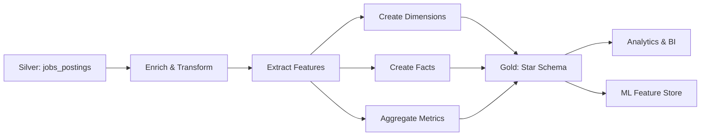

# Gold Layer: Features & Analytics Strategy

## Overview

A camada **Gold** transforma dados limpos da Silver em **features analíticas**, **métricas de negócio** e **datasets otimizados** para consumo em dashboards, APIs e produtos de dados. O foco é gerar **insights acionáveis** sobre o mercado de engenharia de dados.

---

## Objetivos de Negócio

### 1. **Market Intelligence**
- Quais são as skills mais demandadas para Data Engineers?
- Como está a distribuição salarial por seniority e região?
- Quais empresas mais contratam? Quais os setores?

### 2. **Trend Analysis**
- Como está evoluindo a demanda por cloud providers (AWS vs Azure vs GCP)?
- Ferramentas emergentes vs estabelecidas (DBT, Snowflake, Databricks, Airflow)
- Remote vs Onsite vs Hybrid - tendências de modalidade de trabalho

### 3. **Career Insights**
- Quais requisitos técnicos aumentam salário?
- Path de progressão: Junior → Mid → Senior → Staff
- Diferenças regionais (US vs EU vs APAC vs LATAM)

---

## Gold Datasets Propostos

### 1. **Fact Table: `fact_job_postings`**

Granularidade: Uma linha por vaga

| Column | Type | Description |
|--------|------|-------------|
| `job_posting_key` | STRING | Surrogate key (hash de job_posting_id + source_system) |
| `date_key` | INT | FK para dim_date (formato YYYYMMDD) |
| `company_key` | STRING | FK para dim_company |
| `location_key` | STRING | FK para dim_location |
| `seniority_key` | STRING | FK para dim_seniority |
| `employment_type_key` | STRING | FK para dim_employment_type |
| `job_title_normalized` | STRING | Título normalizado (ex: "Data Engineer", "Senior Data Engineer") |
| `num_applicants` | INTEGER | Número de candidatos |
| `salary_avg_usd` | DECIMAL(12,2) | Salário médio convertido para USD |
| `salary_min_usd` | DECIMAL(12,2) | Salário mínimo em USD |
| `salary_max_usd` | DECIMAL(12,2) | Salário máximo em USD |
| `has_salary_info` | BOOLEAN | Se tem informação salarial |
| `is_remote` | BOOLEAN | Se é remoto |
| `days_since_posted` | INTEGER | Dias desde publicação |
| `job_url` | STRING | Link da vaga |
| `source_system` | STRING | Origem (linkedin, indeed, etc) |

**Partitioned by**: `date_key`

**Purpose**: Analytics centrais, dashboards de volume, tendências temporais

---

### 2. **Dimension: `dim_company`**

| Column | Type | Description |
|--------|------|-------------|
| `company_key` | STRING | PK (hash de company_name normalizado) |
| `company_name` | STRING | Nome da empresa |
| `company_name_normalized` | STRING | Nome normalizado (lowercase, sem pontuação) |
| `industry` | STRING | Setor (extraído ou enriquecido) |
| `company_size` | STRING | Porte (Startup, SMB, Enterprise) - enriquecido |
| `headquarters_country` | STRING | País sede |
| `total_job_postings` | INTEGER | Total de vagas históricas |

**Purpose**: Segmentação por empresa, ranking de empregadores

---

### 3. **Dimension: `dim_location`**

| Column | Type | Description |
|--------|------|-------------|
| `location_key` | STRING | PK (hash de city + state + country_code) |
| `city` | STRING | Cidade |
| `state` | STRING | Estado/província |
| `country_code` | STRING | ISO 3166-1 alpha-2 |
| `country_name` | STRING | Nome do país |
| `region` | STRING | Região (North America, Europe, APAC, LATAM) |
| `is_remote` | BOOLEAN | Se é trabalho remoto |
| `timezone` | STRING | Fuso horário principal |

**Purpose**: Análises geográficas, mapas de calor de vagas

---

### 4. **Dimension: `dim_date`**

| Column | Type | Description |
|--------|------|-------------|
| `date_key` | INT | PK (formato YYYYMMDD) |
| `full_date` | DATE | Data completa |
| `year` | INT | Ano |
| `quarter` | INT | Trimestre (1-4) |
| `month` | INT | Mês (1-12) |
| `month_name` | STRING | Nome do mês |
| `week_of_year` | INT | Semana do ano |
| `day_of_week` | INT | Dia da semana (1=Monday) |
| `day_name` | STRING | Nome do dia |
| `is_weekend` | BOOLEAN | Se é fim de semana |
| `is_holiday` | BOOLEAN | Se é feriado (enriquecer) |

**Purpose**: Análises temporais, sazonalidade, tendências

---

### 5. **Feature Table: `features_skills_required`**

Granularidade: Uma linha por (job_posting_key, skill)

| Column | Type | Description |
|--------|------|-------------|
| `job_posting_key` | STRING | FK para fact_job_postings |
| `skill_name` | STRING | Nome da skill (ex: "Python", "AWS", "Spark") |
| `skill_category` | STRING | Categoria (Language, Cloud, Database, Tool, Framework) |
| `skill_level` | STRING | Nível mencionado (Basic, Intermediate, Advanced, Expert) |
| `is_required` | BOOLEAN | Se é requisito obrigatório |
| `is_nice_to_have` | BOOLEAN | Se é desejável |
| `mentioned_count` | INTEGER | Quantas vezes aparece na descrição |

**Purpose**: Análise de skills mais demandadas, correlation com salário

**Como gerar**: NLP/Regex sobre `job_description_text`

---

### 6. **Feature Table: `features_tools_stack`**

Granularidade: Uma linha por (job_posting_key, tool)

| Column | Type | Description |
|--------|------|-------------|
| `job_posting_key` | STRING | FK para fact_job_postings |
| `tool_name` | STRING | Nome da ferramenta (ex: "Airflow", "DBT", "Snowflake") |
| `tool_type` | STRING | Tipo (Orchestration, Data Warehouse, ETL, BI, etc) |
| `vendor` | STRING | Vendor (Apache, Databricks, Snowflake, etc) |

**Purpose**: Qual stack é mais comum? DBT + Snowflake? Airflow + Spark?

---

### 7. **Aggregated: `agg_skills_demand_trend`**

Granularidade: (skill, date, region)

| Column | Type | Description |
|--------|------|-------------|
| `skill_name` | STRING | Nome da skill |
| `date_key` | INT | Mês/semana |
| `region` | STRING | Região geográfica |
| `job_count` | INTEGER | Número de vagas que mencionam a skill |
| `avg_salary_usd` | DECIMAL(12,2) | Salário médio para vagas com essa skill |
| `pct_change_mom` | DECIMAL(5,2) | Variação % month-over-month |
| `rank_in_region` | INTEGER | Ranking de popularidade na região |

**Purpose**: Trending skills, skills em alta vs em queda

---

### 8. **Aggregated: `agg_salary_benchmarks`**

Granularidade: (seniority_level, country, quarter)

| Column | Type | Description |
|--------|------|-------------|
| `seniority_level` | STRING | Entry, Mid, Senior, Staff, Principal |
| `country_code` | STRING | País |
| `quarter_key` | INT | Ano + Quarter (ex: 202501) |
| `job_count` | INTEGER | Número de vagas |
| `salary_p10_usd` | DECIMAL(12,2) | Percentil 10 |
| `salary_p25_usd` | DECIMAL(12,2) | Percentil 25 (Q1) |
| `salary_p50_usd` | DECIMAL(12,2) | Mediana |
| `salary_p75_usd` | DECIMAL(12,2) | Percentil 75 (Q3) |
| `salary_p90_usd` | DECIMAL(12,2) | Percentil 90 |
| `salary_avg_usd` | DECIMAL(12,2) | Média |

**Purpose**: Salary benchmarking por nível e região

---

### 9. **Aggregated: `agg_company_hiring_trends`**

Granularidade: (company_key, month)

| Column | Type | Description |
|--------|------|-------------|
| `company_key` | STRING | FK |
| `company_name` | STRING | Nome da empresa |
| `month_key` | INT | Mês (YYYYMM) |
| `new_job_postings` | INTEGER | Novas vagas no mês |
| `avg_applicants` | DECIMAL(8,2) | Média de candidatos por vaga |
| `pct_remote` | DECIMAL(5,2) | % de vagas remotas |
| `avg_salary_usd` | DECIMAL(12,2) | Salário médio oferecido |

**Purpose**: Quem está contratando mais? Tendências de hiring

---

### 10. **ML Feature Store: `ml_features_job_similarity`**

Para recomendação de vagas similares

| Column | Type | Description |
|--------|------|-------------|
| `job_posting_key` | STRING | PK |
| `title_embedding` | ARRAY&lt;FLOAT&gt; | Vetor de embedding do título (768-dim) |
| `description_embedding` | ARRAY&lt;FLOAT&gt; | Embedding da descrição |
| `skill_vector` | ARRAY&lt;INT&gt; | One-hot encoding de skills |
| `salary_normalized` | FLOAT | Salário normalizado (0-1) |
| `cluster_id` | INTEGER | Cluster de vagas similares (K-means) |

**Purpose**: "Vagas similares", recommendations

---

## Métricas & KPIs Principais

### **Market Dynamics**

| KPI | Description | Calculation |
|-----|-------------|-------------|
| Total Active Jobs | Vagas ativas no período | `COUNT(DISTINCT job_posting_key)` |
| New Jobs This Month | Vagas novas no mês | `COUNT WHERE job_posted_date >= start_of_month` |
| Job Growth Rate | Taxa de crescimento mês a mês | `(This Month - Last Month) / Last Month * 100` |
| Avg Applicants per Job | Competitividade média | `AVG(num_applicants)` |
| Job Posting Velocity | Jobs/dia | `COUNT / days` |

### **Compensation Analytics**

| KPI | Description |
|-----|-------------|
| Median Salary by Seniority | Benchmark salarial |
| Salary Premium for Remote | % a mais para remote vs onsite |
| Top Paying Companies | Top 10 empresas por salário médio |
| Salary Range Transparency | % de vagas com salary_info |

### **Skills Intelligence**

| KPI | Description |
|-----|-------------|
| Top 10 Most Demanded Skills | Ranking de skills |
| Fastest Growing Skills | Skills com maior crescimento (MoM) |
| Skill Saturation Index | Skills em todas as vagas vs raras |
| Skill Salary Correlation | Correlação de skill com salário |

### **Geographic Insights**

| KPI | Description |
|-----|-------------|
| Jobs by Country | Distribuição geográfica |
| Remote Work % | Percentual de vagas remotas |
| Salary Cost of Living Adj | Salário ajustado por COL |

### **Employment Trends**

| KPI | Description |
|-----|-------------|
| Contract vs Full-time % | Distribuição de tipos |
| Seniority Distribution | % Junior/Mid/Senior |
| Industry Breakdown | Setores que mais contratam |

---

## Exemplo de Insights Acionáveis

### 1. **"Python + Spark + AWS é a stack mais bem paga?"**
```sql
SELECT
  ARRAY_AGG(skill_name) as skill_combo,
  AVG(salary_avg_usd) as avg_salary,
  COUNT(*) as job_count
FROM features_skills_required
JOIN fact_job_postings USING (job_posting_key)
WHERE skill_name IN ('Python', 'Spark', 'AWS')
GROUP BY job_posting_key
HAVING COUNT(DISTINCT skill_name) = 3
```

### 2. **"Como está crescendo a demanda por DBT vs Airflow?"**
```sql
SELECT
  tool_name,
  month_key,
  COUNT(*) as mentions,
  LAG(COUNT(*)) OVER (PARTITION BY tool_name ORDER BY month_key) as prev_month
FROM features_tools_stack
WHERE tool_name IN ('DBT', 'Airflow')
GROUP BY tool_name, month_key
```

### 3. **"Benchmark de salário para Senior Data Engineer no Brasil"**
```sql
SELECT
  seniority_level,
  country_code,
  salary_p50_usd as median_salary,
  salary_p75_usd,
  job_count
FROM agg_salary_benchmarks
WHERE seniority_level = 'Senior'
  AND country_code = 'BR'
ORDER BY quarter_key DESC
LIMIT 4
```

---

## Processo de Construção - Silver to Gold

### Pipeline Overview



### Transformações Principais

#### 1. **Title Normalization**
```python
# Normalizar títulos de vagas
"Sr. Data Engineer" → "Senior Data Engineer"
"Data Eng II" → "Mid Data Engineer"
"Staff DE" → "Staff Data Engineer"
```

#### 2. **Salary Standardization**
```python
# Converter todos os salários para USD anual
- hourly → yearly (x 2080 hours)
- monthly → yearly (x 12)
- currency conversion (API ou tabela de FX rates)
```

#### 3. **Skill Extraction**
```python
# NLP/Regex para extrair skills do job_description_text
skills_dict = {
    "Languages": ["Python", "SQL", "Scala", "Java"],
    "Cloud": ["AWS", "Azure", "GCP"],
    "Data Warehouses": ["Snowflake", "Redshift", "BigQuery"],
    "Tools": ["Airflow", "DBT", "Spark", "Kafka"]
}
```

#### 4. **Location Enrichment**
```python
# Enriquecer location com geocoding
"San Francisco, CA" → {
    city: "San Francisco",
    state: "California",
    country_code: "US",
    region: "North America"
}
```

---

## Data Quality Checks (Gold)

| Check | Rule | Action |
|-------|------|--------|
| Salary Sanity | `salary_min <= salary_max` | Flag outliers |
| Date Validity | `job_posted_date <= today` | Reject |
| Dedup | Unique `job_posting_key` | Drop duplicates |
| Completeness | 95%+ of critical fields non-null | Alert |
| Referential Integrity | All FKs exist in dimension tables | Fail pipeline |

---

## Storage & Access Patterns

### Storage Format
- **Format**: Parquet (columnar, compressed)
- **Compression**: Snappy or Zstd
- **Partitioning**: By `year`, `month`, `day` on date dimensions
- **Clustering**: By `country_code`, `seniority_level` for common filters

### Query Optimization
- **Materialized Views**: Pre-compute heavy aggregations
- **Indexes**: On `job_posting_key`, `company_key`, `date_key`
- **Caching**: Cache popular queries (Top 10 skills, Salary benchmarks)

---

## Technology Stack (Gold Pipeline)

| Component | Tool Options |
|-----------|--------------|
| **Transformation** | DBT, Spark SQL, Dataform |
| **Orchestration** | Airflow, Prefect, Dagster |
| **Data Warehouse** | Snowflake, BigQuery, Redshift |
| **BI/Viz** | Looker, Tableau, Metabase, Superset |
| **ML Feature Store** | Feast, Tecton, or custom DynamoDB/Redis |
| **Monitoring** | Great Expectations, dbt tests |

---

## Roadmap de Features

### Phase 1: Foundation (MVP)
- ✅ Fact table de job postings
- ✅ Dimensões básicas (company, location, date)
- ✅ Agregações de salary benchmarks
- ✅ Top 10 skills demanded

### Phase 2: Skills Intelligence
- 🔲 Extração de skills via NLP
- 🔲 Skill correlation analysis
- 🔲 Trending skills dashboard
- 🔲 Skill gap analysis (demand vs supply)

### Phase 3: Market Intelligence
- 🔲 Company hiring trends
- 🔲 Industry benchmarking
- 🔲 Remote work trends
- 🔲 Employment type breakdown

### Phase 4: Predictions & ML
- 🔲 Salary prediction model
- 🔲 Job recommendation engine
- 🔲 Demand forecasting (skills)
- 🔲 Career path suggestions

---

## Example Dashboard Wireframes

### 1. **Market Overview Dashboard**
- Total Active Jobs (KPI card)
- Jobs by Country (Map)
- Top 10 Skills (Bar chart)
- Salary Distribution (Box plot)
- Remote % Trend (Line chart)

### 2. **Skills Intelligence**
- Skills Heatmap (skill x time)
- Skill Correlation Matrix
- Top Paying Skills (Table)
- Emerging vs Declining Skills (Scatter)

### 3. **Salary Benchmarking**
- Salary by Seniority (Bar chart)
- Geographic Salary Comparison (Map + Table)
- Salary Percentiles (Box plot)
- Company Comparison (Table)

### 4. **Company Insights**
- Top Hiring Companies (Leaderboard)
- Company Hiring Velocity (Line chart)
- Average Applicants per Company (Bar)

---

## Conclusão

A camada **Gold** transforma dados estruturados em **insights de negócio**.

### Principais Entregas:
1. **Star Schema** otimizado para analytics
2. **Features prontas para ML**
3. **KPIs e métricas** de mercado
4. **Dashboards interativos** para stakeholders

### Próximos Passos:
1. Implementar pipeline DBT Silver → Gold
2. Validar qualidade de dados com Great Expectations
3. Criar dashboards no Looker/Metabase
4. Expor APIs REST para consumo de features
5. Treinar modelos de ML para salary prediction e job recommendations

---

**Autor:** Data Engineering Team
**Última atualização:** 2025-12-03
**Versão:** 1.0
